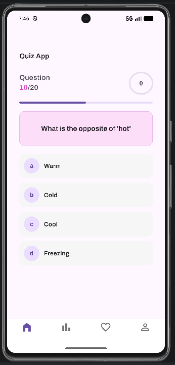
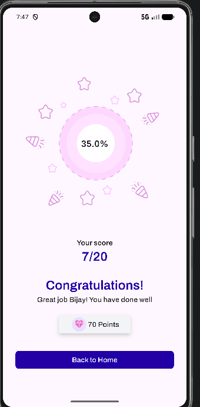

# 📚 Flutter Quiz App

A modern and interactive Quiz Application built with **Flutter**. The app allows users to answer multiple-choice questions, tracks their progress, calculates their score, and displays a beautiful result screen at the end.

## 📱 Screenshots

| Quiz Screen | Result Screen |
|-------------|---------------|
|  |  |

> Place your screenshots inside a `screenshots` folder and update the file names if necessary.

---

## ✨ Features

- 🎯 Multiple Choice Questions (MCQ)
- 📊 Question Progress Indicator
- ⏱️ Real-time Quiz Progress
- ✅ Score Calculation
- 🎉 Beautiful Result Screen
- 🏆 Points Reward UI
- 📱 Responsive Material Design
- 🚀 Smooth Navigation

---

## 🛠️ Built With

- **Flutter**
- **Dart**
- Material Design

---

## 📂 Project Structure

```
lib/
│
├── models/
├── screens/
├── widgets/
├── data/
├── utils/
└── main.dart
```

---

## 🚀 Getting Started

### Prerequisites

- Flutter SDK
- Dart SDK
- Android Studio or VS Code
- Android Emulator or Physical Device

### Installation

Clone the repository

```bash
git clone https://github.com/your-username/flutter-quiz-app.git
```

Go to the project directory

```bash
cd flutter-quiz-app
```

Install dependencies

```bash
flutter pub get
```

Run the application

```bash
flutter run
```

---

## 📸 App Preview

### Quiz Screen

- Displays the current question
- Shows quiz progress
- Multiple-choice answers
- Bottom navigation

### Result Screen

- Circular score indicator
- Total score
- Congratulations message
- Reward points
- Back to Home button

---

## 🎯 Future Improvements

- Timer for each question
- Randomized questions
- Dark Mode
- Category-wise quizzes
- Difficulty Levels
- Leaderboard
- Firebase Integration
- User Authentication
- Online Question Database

---

## 🤝 Contributing

Contributions are welcome!

1. Fork the repository
2. Create your feature branch

```bash
git checkout -b feature/NewFeature
```

3. Commit your changes

```bash
git commit -m "Add new feature"
```

4. Push to the branch

```bash
git push origin feature/NewFeature
```

5. Open a Pull Request

---

## 👨‍💻 Author

**Bijay Nep**

- GitHub: https://github.com/your-username

---

## ⭐ Support

If you like this project, please consider giving it a ⭐ on GitHub.

It helps others discover the project and motivates future improvements.

---

## 📄 License

This project is licensed under the MIT License.
